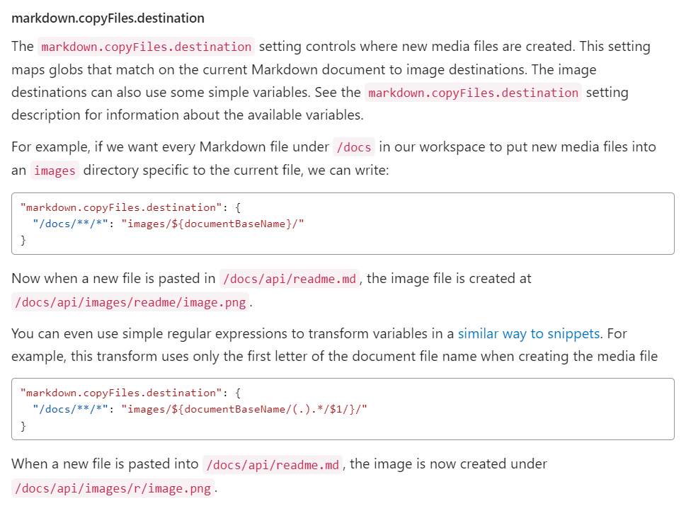

# tables
- table
    - test1
      | no   | name | rank |     |
      | :--- | :--- | :--- | --- |
      | 1-1  | t--t | A--A |     |
      |      |      |      |     |
      | 2    | aa   | B    |     |
      |      |      |      |     |


- figure by draw io
- 


- figure by mermaid
    - ```mermaid
      graph TD;
          A-->B;
          A-->C;
          B-->D;
          C-->D;
      ```


- image paste test
  - 